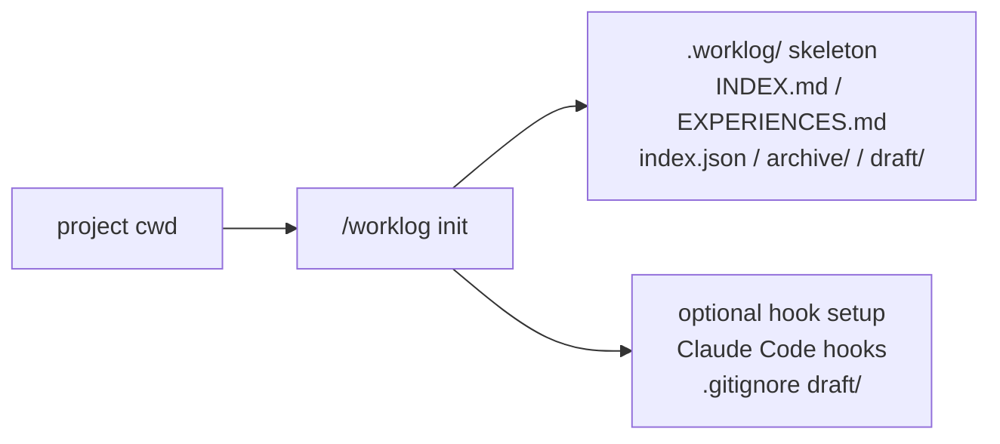
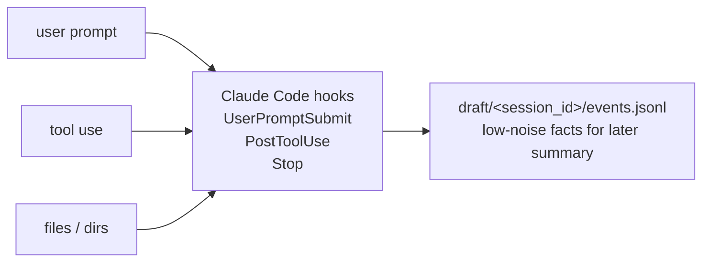
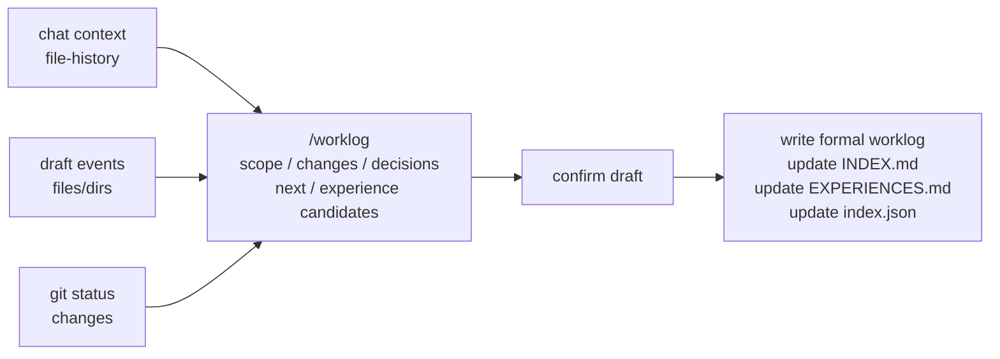

# worklog.skill

[](https://github.com/littlecabbage/worklog-skill/actions/workflows/validate-package.yml)
[](LICENSE)

[中文](README.md)


## Contents

- [Core features](#core-features)
- [Project structure & workflow](#project-structure--workflow)
- [Installation & setup](#installation--setup)
- [Daily usage](#daily-usage)
- [Advanced](#advanced)
- [Privacy](#privacy)
- [Development](#development)
- [License](#license)

A shareable Claude Code skill for turning individual working sessions into searchable work logs and reusable engineering knowledge.

`worklog.skill` helps you capture not just what changed, but also what you learned, what you ruled out, and what should be easy to find again later.

## Core features

The skill supports four session modes: `dev`, `read`, `debug-session`, and `mixed`.

By default it writes project-local artifacts under the current repository's `.worklog/` directory:

- `INDEX.md` for human-readable session history
- `EXPERIENCES.md` for reusable findings, lessons, and deprecations
- `index.json` for machine lookup and `jq`-friendly queries
- `draft/<session_id>/events.jsonl` for structured events captured by the optional hook layer

Root selection is local-first:

- default: nearest git repository's `.worklog/`
- outside git: current directory's `.worklog/`
- explicit global override: pass `--root ~/.claude/worklog`

## Project structure & workflow

Once initialized, `.worklog/` appears in your project:

```text
.worklog/
├── INDEX.md                  # human-readable session index
├── EXPERIENCES.md            # reusable experiences, lessons, deprecations
├── index.json                # machine-searchable index
├── archive/                  # archived entries
└── draft/<session_id>/        # optional hook-captured structured events
    └── events.jsonl
```

### Workflow

#### 1. Init phase



Run `init_worklog.py` in your project to create the `.worklog/` skeleton and optionally install Claude Code hooks.

#### 2. Capture phase



During a session, hooks continuously write prompts, tool calls, file paths, command targets, and affected directories into `draft/<session_id>/events.jsonl`.

#### 3. Finalize phase



At session end (or when you explicitly ask), Claude reads the current context, hook events, file-history snapshots, and git state, summarizes scope, key changes, decisions, unfinished items, and experience candidates, then writes the worklog and updates the indexes after your confirmation.

## Installation & setup

### Get the code

```bash
git clone https://github.com/littlecabbage/worklog-skill.git
```

Requires Python ≥ 3.9.

### Install

Option 1 — copy the skill directory:

```bash
cp -R worklog ~/.claude/skills/
```

Option 2 — build a distributable `.skill` package:

```bash
python3 tools/package_skill.py worklog ./dist
```

This creates `dist/worklog.skill`.

### Initialize

From inside a project, run:

```bash
python3 worklog/scripts/init_worklog.py
```

By default this does three things:

- creates `.worklog/INDEX.md`, `EXPERIENCES.md`, `index.json`, and `archive/`
- installs capture hooks at `~/.claude/hooks/worklog-capture.sh` and registers them in `.claude/settings.local.json`
- appends `/.worklog/draft/` to `.gitignore`

Useful flags:

- `--dry-run` — print the plan without writing
- `--skip-hooks` — only create the skeleton
- `--skip-gitignore` — leave `.gitignore` alone
- `--global` — register hooks in `~/.claude/settings.json` instead of the project
- `--uninstall` — reverse the install, preserving `.worklog/` data

## Daily usage

Ask Claude in natural language:

- "Record this session."
- "Save a worklog for what we just did."
- "Record this session as a mixed worklog."
- "Save this debugging session."
- "Search prior experiences about cache invalidation."
- "Deprecate the passive_deletes experience."

When triggered, Claude reads the captured events, file-history snapshots, and git state, drafts a save-ready summary, and asks one compact confirmation before writing.

The default interaction is context-first and draft-first. `/worklog` should not start by asking you to fill title, status, tags, and sections. It should first show the inferred mode, evidence, title, summary bullets, and pending experience candidates.

Use `/worklog edit` or `/worklog guided` only when you want detailed field-by-field control.

## Advanced

### Active capture

When `init_worklog.py` installs hooks, three Claude Code command hooks record structured events into `.worklog/draft/<session_id>/events.jsonl`:

- `UserPromptSubmit` — user prompt (truncated to 500 chars)
- `PostToolUse` — tool name + target file or command (truncated to 256 chars, redacted)
- `Stop` — last assistant reply excerpt (300 chars)

Sensitive file paths are redacted at capture time (`.env*`, `*secret*`, `*credential*`, `*token*`, `*.pem`, `*.key`, `id_rsa*`, anything under `.ssh/` or `.aws/`, `.netrc`).

The hook layer never calls an LLM, never blocks the main conversation, and silently exits on any failure. Multiple concurrent sessions in the same project are isolated by session-id.

To temporarily disable capture, set `WORKLOG_HOOK_ACTIVE=1`.

To remove the capture layer entirely:

```bash
python3 worklog/scripts/init_worklog.py --uninstall
```

This removes the hooks and the `.gitignore` entry but preserves all `.worklog/` data.

To manage hooks separately from the skeleton:

```bash
python3 worklog/scripts/hooks_install.py
python3 worklog/scripts/hooks_install.py --uninstall
```

Same `--project` / `--global` / `--dry-run` flags as `init_worklog.py`.

### Script interface

**Record a session:** `finish_worklog.py` accepts JSON via stdin or `--input`:

```bash
python3 worklog/scripts/finish_worklog.py <<'EOF'
{
  "mode": "dev",
  "language": "en",
  "title": "Implement soft delete for users",
  "started_at": "2026-05-12T09:30:00+08:00",
  "duration_minutes": 90,
  "status": "completed",
  "tags": ["dev", "backend"],
  "sections": {
    "goal": "Add soft delete support for users.",
    "completed": ["Added deleted_at column.", "Updated service queries."],
    "key_decisions": [{"decision": "Nullable timestamp", "why": "preserves deletion time"}]
  }
}
EOF
```

Draft-first payloads can omit fields that the script can safely default before validation.

Example for `read` mode:

```bash
python3 worklog/scripts/finish_worklog.py <<'EOF'
{
  "mode": "read",
  "language": "en",
  "title": "Understand scheduler wake-up path",
  "started_at": "2026-05-12T09:00:00+08:00",
  "duration_minutes": 55,
  "status": "partial",
  "tags": ["read", "scheduler"],
  "read_type": "deep-dive",
  "target": "my-repo",
  "target_version": "main",
  "completion": 70,
  "sections": {
    "reading_goal": "Understand why delayed jobs wake late.",
    "entry_points": ["scheduler.py:120", "queue.py:44"],
    "mental_model": "Wake-up time is calculated once, then adjusted only after dequeue.",
    "key_findings": ["Clock skew is not the issue.", "Late wake-ups start after retry backoff."],
    "open_questions": ["Need to confirm whether backoff mutates in place."],
    "evidence": ["scheduler.py:120-178", "queue.py:44-80"],
    "follow_on_output": ["Add one experience if the backoff mutation is confirmed."]
  }
}
EOF
```

Full field definitions at [worklog/references/worklog-format.md](worklog/references/worklog-format.md).

**Rebuild indexes** after manual edits:

```bash
python3 worklog/scripts/reindex_worklog.py
```

**Search logs:**

```bash
python3 worklog/scripts/search_worklog.py "cache invalidation"
```

### Output language

The main agent infers the conversation language at finalize time and writes `language` (`zh` or `en`) into the payload. Mixed or unclear conversations default to `zh`. Only structural text (section headers, table column names, INDEX / EXPERIENCES preamble) is affected; bullet content and frontmatter keys stay as written.

## Privacy

This repository ships the skill source code only. It does not upload or sync your project `.worklog/` data.

The capture hook layer records file *paths* and tool names, never tool output content. Sensitive file paths are redacted at capture time. User prompts are recorded literally (truncated, but not redacted) — if your prompts can contain secrets, disable capture before pasting them or run `init_worklog.py --uninstall`.

If you want to share worklog history, do that intentionally through your own storage or version-control workflow.

## Development

### Repository layout

```text
worklog/
├── worklog/                  # Claude skill source
│   ├── SKILL.md
│   ├── scripts/              # init / capture_hook / hooks_install / finish / reindex / search
│   ├── references/           # worklog format reference
│   └── tests/                # unittest suite (52 tests)
├── tools/                    # Local validation and packaging helpers
└── .github/workflows/        # CI validation and packaging
```

### Local development

Run the unittest suite:

```bash
python3 -m unittest discover worklog/tests
```

Local smoke test:

```bash
python3 -m py_compile worklog/scripts/*.py tools/*.py
python3 worklog/scripts/init_worklog.py --root /tmp/worklog-test --skip-hooks
python3 worklog/scripts/reindex_worklog.py --root /tmp/worklog-test
python3 tools/package_skill.py worklog ./dist
```

The GitHub Actions workflow validates the skill structure, compiles the scripts, runs an end-to-end smoke test, and packages the skill.

### Contributing

Issues and PRs welcome. Before submitting, please run:

```bash
python3 -m unittest discover worklog/tests
```

## License

MIT
