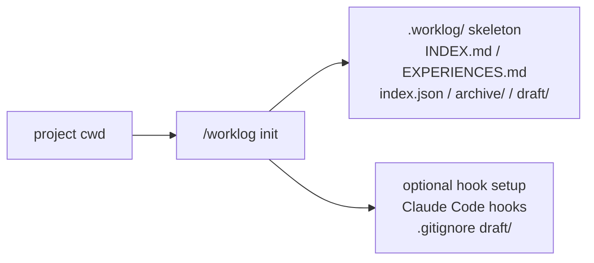
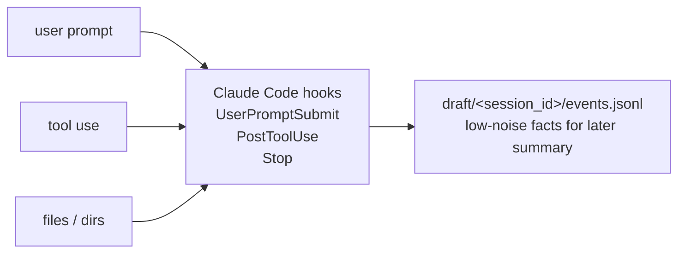
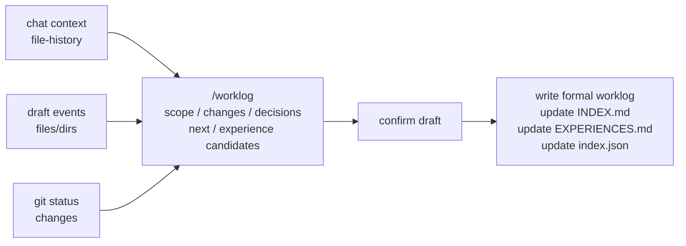

# worklog.skill

[](https://github.com/littlecabbage/worklog-skill/actions/workflows/validate-package.yml)
[](LICENSE)

[中文](README.md)


A Claude Code skill that turns a working session into a project-local, searchable, reusable work log. It captures information you can't easily recover from code or chat history later: why you picked the current approach, which assumptions you ruled out, how a bug was traced, and where to resume next time.

It is **not** an issue tracker, daily report, or project documentation — it is the **local memory layer for engineering context**.

## Core features

- **Project-local**: writes to the current project's `.worklog/` by default; goals, decisions, debugging traces, and reusable findings live next to the code.
- **Hook-driven capture + end-of-session summary**: Claude Code hooks collect prompts, tool calls, and file/dir signals during the session; Claude composes a formal worklog at the end.
- **Readable by humans and agents**: `INDEX.md` / `EXPERIENCES.md` for browsing, `index.json` for `jq` and scripts.

## Project structure

After init, `.worklog/` appears in the project:

```text
.worklog/
├── INDEX.md              # human-readable session index
├── EXPERIENCES.md        # reusable experiences, lessons, deprecations
├── index.json            # machine-searchable index
├── archive/              # archived entries
└── draft/<session_id>/   # optional hook-captured event stream
    └── events.jsonl
```

Storage is local-first: inside a git repo it writes to the repo root's `.worklog/`; outside git it uses the current directory.

<details>
<summary>Workflow diagrams (init / capture / finalize)</summary>

### 1. Init



### 2. Capture



### 3. Finalize



</details>

## Installation & setup

Requires Python ≥ 3.9.

```bash
git clone https://github.com/littlecabbage/worklog-skill.git
cp -R worklog ~/.claude/skills/        # or python3 tools/package_skill.py worklog ./dist
```

Initialize from inside a project:

```bash
python3 worklog/scripts/init_worklog.py
```

This does three things by default: creates the `.worklog/` skeleton; installs three hooks in `.claude/settings.local.json` (shim at `~/.claude/hooks/worklog-capture.sh`); appends `/.worklog/draft/` to `.gitignore`.

Useful flags: `--dry-run` (print only), `--skip-hooks`, `--skip-gitignore`, `--global` (register hooks in `~/.claude/settings.json`), `--uninstall` (reverse the install, preserves `.worklog/` data).

## Daily usage

Just ask in natural language:

- "Record this session."
- "Save a worklog for what we just did."
- "Save this debugging session."
- "Search prior experiences about cache invalidation."
- "Deprecate the passive_deletes experience."

When triggered, Claude reads chat context, hook events, file-history, and git state, drafts a save-ready summary, and asks one compact confirmation before writing. The default flow is context-first / draft-first — it won't make you fill in title, status, and tags up front.

## Advanced

### Active capture

The three hooks installed by `init_worklog.py` write structured events to `.worklog/draft/<session_id>/events.jsonl`:

- `UserPromptSubmit` — user prompt (truncated to 500 chars)
- `PostToolUse` — tool name + target file or command (truncated to 256 chars, redacted)
- `Stop` — last assistant reply excerpt (300 chars)

The capture layer never calls an LLM, never blocks the main conversation, and exits silently on failure. Concurrent sessions in the same project are isolated by session-id.

Sensitive paths are redacted at capture time: `.env*`, `*secret*`, `*credential*`, `*token*`, `*.pem`, `*.key`, `id_rsa*`, anything under `.ssh/` or `.aws/`, `.netrc`.

To temporarily disable: `export WORKLOG_HOOK_ACTIVE=1`. To remove entirely: `python3 worklog/scripts/init_worklog.py --uninstall`.

### Script interface

Record a worklog (`finish_worklog.py` reads JSON from stdin or `--input`):

```bash
python3 worklog/scripts/finish_worklog.py <<'EOF'
{
  "mode": "dev",
  "title": "Implement soft delete for users",
  "status": "completed",
  "started_at": "2026-05-12T09:30:00+08:00",
  "duration_minutes": 90,
  "tags": ["dev", "backend"],
  "summary": "Added soft-delete columns and updated service queries.",
  "body": "## Goal\n\nAdd soft delete support for users.\n\n## Done\n\n- Added deleted_at column\n- Updated service queries\n",
  "meta": {"branch": "feature/soft-delete"}
}
EOF
```

Required fields: `mode` / `title` / `summary` / `body` / `status` / `started_at` / `duration_minutes`. `language` is auto-detected from the body's CJK ratio when omitted. Pass `--validate-only` to check without writing.

Full schema: [worklog/references/worklog-format.md](worklog/references/worklog-format.md).

Other commands:

```bash
python3 worklog/scripts/reindex_worklog.py                # rebuild indexes after manual edits
python3 worklog/scripts/search_worklog.py "cache invalidation"
```

## Privacy

This repository ships skill source code only; it does not upload your `.worklog/` data. The capture hooks record file paths and tool names, not tool output content; sensitive paths are redacted at capture time.

User prompts are recorded literally (truncated, not redacted). If a prompt may contain secrets, set `WORKLOG_HOOK_ACTIVE=1` before pasting, or `--uninstall` the capture layer. Share worklog history only intentionally through your own storage or version-control workflow.

## Development

```text
worklog/
├── worklog/                  # Claude skill source (SKILL.md / scripts / references / tests)
├── tools/                    # local validation and packaging helpers
└── .github/workflows/        # CI validation and packaging
```

Run tests:

```bash
python3 -m unittest discover worklog/tests
```

CI validates skill structure, compiles scripts, runs an end-to-end smoke test, and packages the skill. Issues and PRs welcome — please run the test suite before submitting.

## License

MIT
