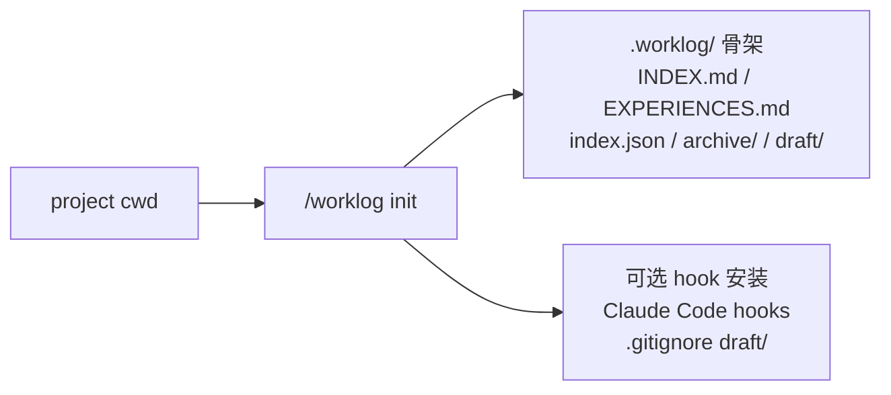
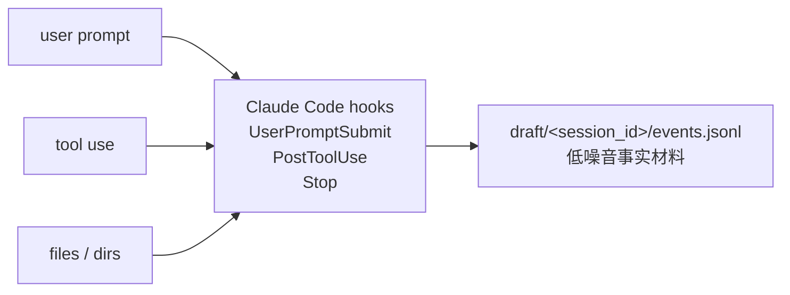
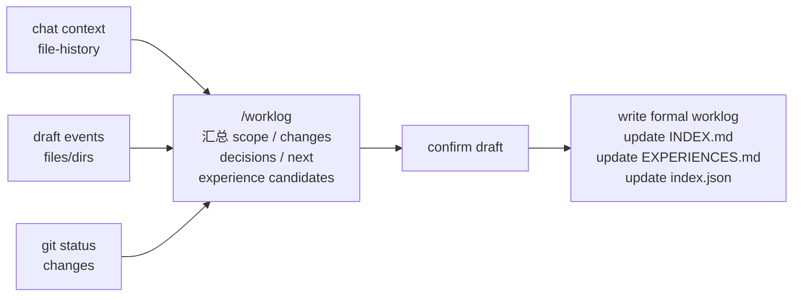

# worklog.skill

[](https://github.com/littlecabbage/worklog-skill/actions/workflows/validate-package.yml)
[](LICENSE)

[English](README.en.md)


`worklog.skill` 是一个 Claude Code skill，把一次工作会话沉淀成项目本地、可检索、可复用的工作日志。它保留事后单看代码或聊天记录恢复不出来的信息：为什么选了当前方案、哪些假设被排除、bug 怎么定位、下次从哪里接上。

定位上不是 issue tracker、日报或项目文档，而是**工程上下文的本地记忆层**。

## 核心特性

- **项目本地**：默认写入当前项目的 `.worklog/`，目标、决策、排障过程和经验沉淀在代码旁边。
- **hook 自动采集 + 结束时汇总**：会话进行时通过 Claude Code hook 收集 prompt、工具调用、文件目录线索；结束时由 Claude 汇总成正式 worklog。
- **人和 agent 都能读**：`INDEX.md` / `EXPERIENCES.md` 给人浏览，`index.json` 给 `jq` 和脚本检索。

## 项目结构

初始化后项目会出现 `.worklog/`：

```text
.worklog/
├── INDEX.md              # 人类可读的会话索引
├── EXPERIENCES.md        # 可复用经验、教训、过期记录
├── index.json            # 机器检索索引
├── archive/              # 归档区
└── draft/<session_id>/   # 可选 hook 采集的事件流
    └── events.jsonl
```

存储遵循 local-first：在 git 仓库里写到仓库根 `.worklog/`，不在 git 仓库里写到当前目录 `.worklog/`。

<details>
<summary>工作流图（init / 采集 / finalize 三阶段）</summary>

### 1. init



### 2. 中间 hook 采集



### 3. finalize 总结



</details>

## 安装与初始化

需要 Python ≥ 3.9。

```bash
git clone https://github.com/littlecabbage/worklog-skill.git
cp -R worklog ~/.claude/skills/        # 或 python3 tools/package_skill.py worklog ./dist
```

进入项目目录初始化：

```bash
python3 worklog/scripts/init_worklog.py
```

默认做三件事：建 `.worklog/` 骨架；在 `.claude/settings.local.json` 注册三个 hook（shim 装到 `~/.claude/hooks/worklog-capture.sh`）；给 `.gitignore` 追加 `/.worklog/draft/`。

常用参数：`--dry-run`（只打印计划）、`--skip-hooks`、`--skip-gitignore`、`--global`（hook 注册到 `~/.claude/settings.json`）、`--uninstall`（反向卸载，保留 `.worklog/` 数据）。

## 日常用法

自然语言触发即可：

- `记录这次会话。`
- `把刚才做的事保存成 worklog。`
- `保存这次 debug 会话。`
- `查一下以前关于 cache invalidation 的经验。`
- `把 passive_deletes 那条经验标记过期。`

触发后 Claude 综合对话上下文、hook 事件、file-history 和 git 状态生成草稿，确认后写入 `.worklog/`。默认是 context-first / draft-first：不会一开始就要你填标题、状态、标签。

## 进阶

### 主动采集

`init_worklog.py` 安装的三个 hook 把结构化事件写到 `.worklog/draft/<session_id>/events.jsonl`：

- `UserPromptSubmit`：用户 prompt（截断 500 字符）
- `PostToolUse`：工具名、目标文件或命令（截断 256 字符，路径脱敏）
- `Stop`：assistant 最后一条回复摘要（截断 300 字符）

采集层不调 LLM、不阻塞主对话、失败静默退出。多并发会话按 session-id 物理隔离。

敏感路径在采集时脱敏：`.env*` / `*secret*` / `*credential*` / `*token*` / `*.pem` / `*.key` / `id_rsa*` / `.ssh/` 与 `.aws/` 下任何文件 / `.netrc`。

临时禁用采集：`export WORKLOG_HOOK_ACTIVE=1`。彻底移除：`python3 worklog/scripts/init_worklog.py --uninstall`。

### 脚本接口

写入一条 worklog（`finish_worklog.py` 接收 stdin 或 `--input` 的 JSON payload）：

```bash
python3 worklog/scripts/finish_worklog.py <<'EOF'
{
  "mode": "dev",
  "title": "Quick smoke test",
  "status": "completed",
  "started_at": "2026-05-18T10:00:00+08:00",
  "duration_minutes": 5,
  "tags": ["smoke"],
  "summary": "验证 body-first payload 能写出 worklog 并进入索引。",
  "body": "## 目标\n\n冒烟测试\n\n## 完成\n\n- 调通 finish_worklog.py\n"
}
EOF
```

必填字段：`mode` / `title` / `summary` / `body` / `status` / `started_at` / `duration_minutes`。`language` 省略时按 body 的 CJK 字符占比自动推断。`--validate-only` 只校验不写入。

完整 schema 见 [worklog/references/worklog-format.zh.md](worklog/references/worklog-format.zh.md)。

其他子命令：

```bash
python3 worklog/scripts/reindex_worklog.py                # 手动改了 .worklog/ 后重建索引
python3 worklog/scripts/search_worklog.py "cache invalidation"
```

## 隐私

这个仓库只发布 skill 源码，不会上传你的 `.worklog/` 数据。采集 hook 只记录文件路径和工具名，不记录工具输出；敏感路径在采集时脱敏。

用户 prompt 会被原文记录（仅截断不脱敏）。如果 prompt 里可能包含密钥，粘贴前临时设 `WORKLOG_HOOK_ACTIVE=1`，或直接 `--uninstall`。分享 worklog 历史时请通过自己的存储或版本控制流程有意识地发布。

## 开发

```text
worklog/
├── worklog/                  # Claude skill 源码（SKILL.md / scripts / references / tests）
├── tools/                    # 本地校验和打包工具
└── .github/workflows/        # CI 校验和打包
```

跑测试：

```bash
python3 -m unittest discover worklog/tests
```

CI 会校验 skill 结构、编译脚本、跑端到端烟雾测试并打包。欢迎提 Issue 和 PR，提交前请先跑测试。

## 许可证

MIT
