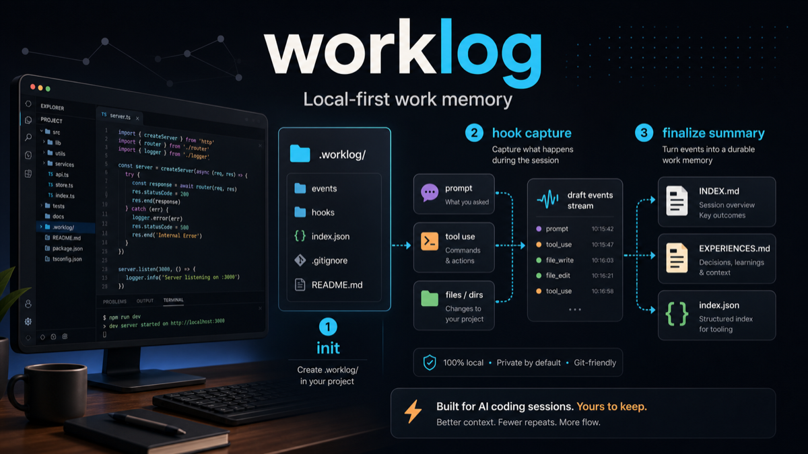
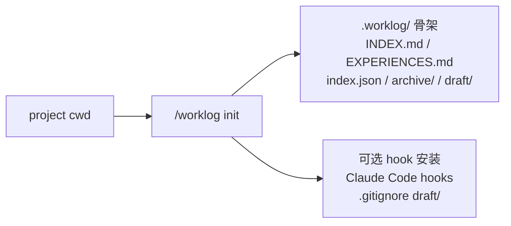
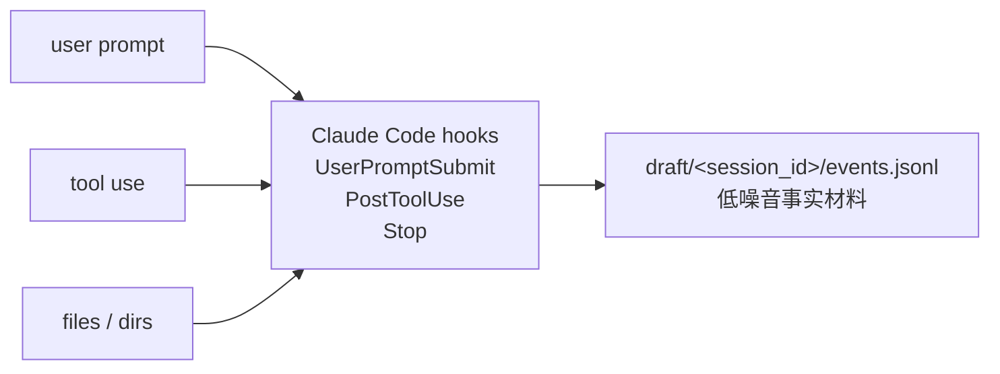
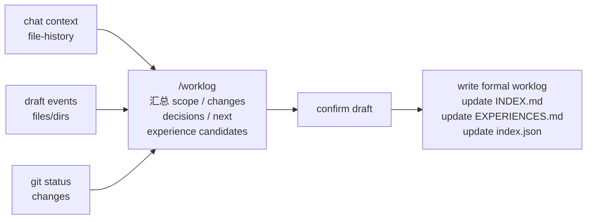

# worklog.skill

[](https://github.com/littlecabbage/worklog-skill/actions/workflows/validate-package.yml)
[](LICENSE)

[English](README.en.md)



## 目录

- [核心特性](#核心特性)
- [项目结构和工作流](#项目结构和工作流)
- [安装与初始化](#安装与初始化)
- [日常用法](#日常用法)
- [进阶](#进阶)
- [隐私](#隐私)
- [开发](#开发)
- [许可证](#许可证)

`worklog.skill` 是一个 Claude Code skill，用来把一次工作会话沉淀成本地、可检索、可复用的工作日志。

很多工作结束后，真正有价值的信息并不在最终代码里：为什么选择了当前方案、哪些假设被排除、读懂源码后形成了什么 mental model、bug 是怎么一步步定位的、下次继续时应该从哪里接上。这些信息散落在对话、工具调用和临时判断里，事后很难只靠 git diff 或聊天记录恢复。

`worklog.skill` 的动机是把这些容易丢失的工程上下文，在会话结束时整理成项目本地的工作记忆。它不是 issue tracker、日报系统或完整项目文档，而是帮你保留：

- 一次实现、阅读、排障或混合任务的目标、过程和结果
- 关键决策、排除路径、证据和仍未完成的线索
- 未来可以检索、复用、更新或标记过期的工程经验

## 核心特性

- **项目本地的工作记忆**：默认写入当前项目的 `.worklog/`，把目标、决策、排障过程和可复用经验沉淀在代码旁边。
- **hook 自动采集，结束时汇总**：短期通过 Claude Code hook 自动收集 prompt、工具调用、文件和目录线索；会话结束时由 Claude 汇总涉及范围、关键变更和 summary。
- **人和 agent 都能读**：`INDEX.md` 和 `EXPERIENCES.md` 给人浏览，`index.json` 给脚本、检索和 `jq` 使用。

## 项目结构和工作流

初始化后，项目里会出现 `.worklog/`。它既是本地存储目录，也是后续检索和总结的输入来源：

```text
.worklog/
├── INDEX.md                  # 人类可读的会话索引
├── EXPERIENCES.md            # 可复用经验、教训和过期记录
├── index.json                # 机器检索索引
├── archive/                  # 归档区
└── draft/<session_id>/        # 可选 hook 采集的结构化事件
    └── events.jsonl
```

### 工作流

#### 1. init 阶段



在项目中运行 `init_worklog.py`，创建 `.worklog/` 骨架，初始化 `INDEX.md`、`EXPERIENCES.md`、`index.json`，并按需安装 Claude Code hook。

#### 2. 中间 hook 采集阶段



会话进行时，hook 持续把 prompt、工具调用、文件路径、命令目标和涉及目录写入 `draft/<session_id>/events.jsonl`，为后续 summary 保留低噪音事实材料。

#### 3. finalize 总结阶段



会话结束或用户显式要求记录时，Claude 读取当前上下文、hook 事件、file-history 和 git 状态，汇总本次涉及的文件夹、关键变更、决策、未完成事项和经验候选，确认后写入正式 worklog，并更新索引。

默认存储遵循 local-first：

- 在 git 仓库里：写入最近的仓库根目录 `.worklog/`
- 不在 git 仓库里：写入当前目录 `.worklog/`
- 需要旧式全局布局时：显式传入 `--root ~/.claude/worklog`

## 安装与初始化

### 获取

```bash
git clone https://github.com/littlecabbage/worklog-skill.git
```

需要 Python ≥ 3.9。

### 安装

方式一：复制 skill 目录到 Claude Code：

```bash
cp -R worklog ~/.claude/skills/
```

方式二：打包成 `.skill` 文件：

```bash
python3 tools/package_skill.py worklog ./dist
```

会生成 `dist/worklog.skill`。

### 初始化

进入项目目录，运行：

```bash
python3 worklog/scripts/init_worklog.py
```

默认做三件事：

- 创建 `.worklog/INDEX.md`、`EXPERIENCES.md`、`index.json`、`archive/`
- 在 `~/.claude/hooks/worklog-capture.sh` 安装 shim，并在 `.claude/settings.local.json` 里注册三个 hook
- 给 `.gitignore` 追加 `/.worklog/draft/`

常用参数：

- `--dry-run`：只打印计划，不写文件
- `--skip-hooks`：只建骨架，不安装 hook
- `--skip-gitignore`：不修改 `.gitignore`
- `--global`：把 hook 注册到 `~/.claude/settings.json`，而不是项目级配置
- `--uninstall`：反向卸载 hook 和 `.gitignore` 条目，保留 `.worklog/` 数据

## 日常用法

常用表达：

- `记录这次会话。`
- `把刚才做的事保存成 worklog.skill。`
- `把这次会话记录成 mixed worklog.skill。`
- `保存这次 debug 会话。`
- `查一下以前关于 cache invalidation 的经验。`
- `把 passive_deletes 那条经验标记过期。`

触发保存后，Claude 会综合当前上下文、hook 采集事件、file-history 快照和 git 状态，先生成草稿，确认后写入 `.worklog/`。

默认交互是 context-first / draft-first。`/worklog` 不应该一开始就要求你填写标题、状态、标签和 sections，而应该先展示推断的 mode、证据、标题、摘要要点和待确认的经验候选。

只有当你明确想逐项精修时，才使用 `/worklog edit` 或 `/worklog guided`。

## 进阶

### 主动采集

`init_worklog.py` 会安装三个 Claude Code command hook，把结构化事件写到 `.worklog/draft/<session_id>/events.jsonl`：

- `UserPromptSubmit`：用户 prompt，截断到 500 字符
- `PostToolUse`：工具名和目标文件或命令，截断到 256 字符，路径脱敏
- `Stop`：assistant 最后一条回复摘要，截断到 300 字符

采集层只提供事实材料，不调用 LLM，不阻塞主对话，失败时静默退出。同一项目里的多个并发会话会按 session-id 物理隔离。

敏感文件路径会在采集时脱敏：

- `.env*`
- `*secret*`
- `*credential*`
- `*token*`
- `*.pem`
- `*.key`
- `id_rsa*`
- `.ssh/` 和 `.aws/` 下的任何文件
- `.netrc`

需要临时禁用采集时，设置环境变量：

```bash
export WORKLOG_HOOK_ACTIVE=1
```

要彻底移除采集层：

```bash
python3 worklog/scripts/init_worklog.py --uninstall
```

这会移除 hook 注册和 `.gitignore` 条目，但保留所有 `.worklog/` 数据。

只想单独管理 hook，不动 `.worklog/` 骨架：

```bash
python3 worklog/scripts/hooks_install.py
python3 worklog/scripts/hooks_install.py --uninstall
```

支持的 `--project`、`--global`、`--dry-run` 参数和 `init_worklog.py` 一致。

### 脚本接口

**写入一条会话：** `finish_worklog.py` 从 stdin 或 `--input` 接收 JSON payload。新版采用 body-first：你直接给一段 markdown，脚本原样写入：

```bash
python3 worklog/scripts/finish_worklog.py <<'EOF'
{
  "mode": "dev",
  "title": "Quick smoke test",
  "status": "completed",
  "started_at": "2026-05-18T10:00:00+08:00",
  "duration_minutes": 5,
  "tags": ["smoke"],
  "summary": "验证 body-first payload 能写出 worklog 并进入索引。",
  "body": "## 目标\n\n冒烟测试\n\n## 完成\n\n- 调通 finish_worklog.py\n"
}
EOF
```

必填字段：`mode` / `title` / `summary` / `body` / `status` / `started_at` / `duration_minutes`。`language` 省略时按 body 的中文字符占比自动推断。`--validate-only` 只校验不写入。

旧的 `sections` payload 已不再支持，脚本遇到会直接报错。

完整字段定义见 [worklog/references/worklog-format.zh.md](worklog/references/worklog-format.zh.md)。

**重建索引：** 手动修改 `.worklog/` 后，可以重建索引：

```bash
python3 worklog/scripts/reindex_worklog.py
```

**搜索日志：**

```bash
python3 worklog/scripts/search_worklog.py "cache invalidation"
```

### 输出语言

`language` 字段控制脚本生成的结构性文本（INDEX.md / EXPERIENCES.md 标题、preamble、tag 索引）。`body` 是你写好的 markdown，章节标题用什么语言由你决定。

- `zh`：中文结构标题
- `en`：英文结构标题

省略字段时脚本按 body 的 CJK 字符占比自动推断（>30% → `zh`，否则 `en`），失败回退 `zh`。frontmatter key 永远是英文。

## 隐私

这个仓库只发布 skill 源码，不会上传或同步你的项目 `.worklog/` 数据。

采集 hook 只记录文件路径和工具名，不记录工具输出内容。敏感文件路径会在采集时脱敏。

用户 prompt 会被原文记下，只截断不脱敏。如果 prompt 里可能包含密钥，粘贴前先临时禁用采集，或者运行：

```bash
python3 worklog/scripts/init_worklog.py --uninstall
```

如果你想分享 worklog 历史，请通过自己的存储或版本控制流程有意识地发布。

## 开发

### 仓库结构

```text
worklog/
├── worklog/                  # Claude skill 源码
│   ├── SKILL.md
│   ├── scripts/              # init / capture_hook / hooks_install / finish / reindex / search
│   ├── references/           # worklog 格式参考
│   └── tests/                # unittest 套件 (52 个测试)
├── tools/                    # 本地校验和打包工具
└── .github/workflows/        # CI 校验和打包
```

### 本地开发

跑 unittest 套件：

```bash
python3 -m unittest discover worklog/tests
```

本地烟雾测试：

```bash
python3 -m py_compile worklog/scripts/*.py tools/*.py
python3 worklog/scripts/init_worklog.py --root /tmp/worklog-test --skip-hooks
python3 worklog/scripts/reindex_worklog.py --root /tmp/worklog-test
python3 tools/package_skill.py worklog ./dist
```

GitHub Actions 会校验 skill 结构、编译脚本、跑端到端烟雾测试，并打包 skill。

### 参与贡献

欢迎提 Issue 和 PR。提交前请先跑：

```bash
python3 -m unittest discover worklog/tests
```

## 许可证

MIT
